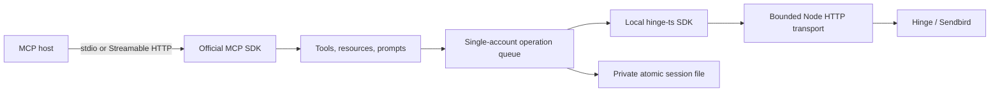

# hinge-mcp

A TypeScript [Model Context Protocol](https://modelcontextprotocol.io/) server for your own Hinge account.

It exposes **23 tools, three resources, one resource template, three prompts, and prompt-argument completion**. It runs locally over **stdio**, or over **Streamable HTTP** with an optional static bearer token or OAuth resource-server authentication. The optional raw tool brings the total to 24.

Uses the official MCP TypeScript SDK **2.1.0**. The compiled CLI is tested with the **2026-07-28 protocol and legacy clients**, over both transports. The SDK handles protocol framing, discovery/initialization, negotiation, schemas, and errors.

This project is unofficial and unaffiliated with Hinge, Match Group, Sendbird, OpenAI, or Anthropic. The Hinge API is reverse engineered and can change independently of this server. Use only an account you control. Review Hinge's terms before use.

## Quick start

Requirements: **Node.js 22 or 24**, npm, and a Hinge account for live use. Windows, macOS, and Linux are covered by CI.

```sh
git clone https://github.com/Kuberwastaken/hinge-mcp.git
cd hinge-mcp
npm ci
npm run build
node mcp/dist/cli.js --help
```

Configure your MCP host to launch `node` with the **absolute path** to `mcp/dist/cli.js`. The host owns stdin/stdout; starting the CLI in a terminal without an MCP client will simply wait for protocol messages. Do not use `npm start` as the host's stdio command because npm can print non-protocol banners.

Start with `HINGE_MCP_READ_ONLY=1` if you only want account reads. Login and logout remain available in that mode. No login or network request occurs just from discovering tools.

No npm release is implied by this repository. Do not assume `npx hinge-mcp` installs this fork. To install the exact code you built:

```sh
npm pack --workspace mcp --pack-destination .
npm install -g ./hinge-mcp-0.2.0.tgz
hinge-mcp --version
```

The tarball contains the compiled server, bundled local SDK, TypeScript declarations, README and its hero image, the complete agent guide, and MIT license. It does not need this checkout or a `file:` dependency at runtime. Rebuild before packing after source changes.

## Connect a client

These configurations follow the linked vendors' official documentation. Automated tests exercise the wire protocols with official SDK clients; they do **not** claim that every vendor application's UI has been manually tested. Hosts differ in whether they display resources, prompts, or completion. The tools work independently of those optional host interfaces.

### Claude Desktop and Cursor

Use this stdio entry in Claude Desktop's developer configuration or Cursor's `.cursor/mcp.json` / `~/.cursor/mcp.json`. Replace the path; forward slashes also work on Windows (`C:/path/to/hinge-mcp/mcp/dist/cli.js`).

```json
{
  "mcpServers": {
    "hinge": {
      "command": "node",
      "args": ["/absolute/path/to/hinge-mcp/mcp/dist/cli.js"],
      "env": {
        "HINGE_PHONE_NUMBER": "+15555550123",
        "HINGE_MCP_READ_ONLY": "1"
      }
    }
  }
}
```

Restart/reload the host and run `hinge_session_status`. Cursor also supports HTTP with an `Authorization` header; see [Cursor MCP documentation](https://cursor.com/docs/mcp).

### Claude Code

```sh
claude mcp add --env HINGE_PHONE_NUMBER=+15555550123 HINGE_MCP_READ_ONLY=1 --transport stdio hinge -- node /absolute/path/to/hinge-mcp/mcp/dist/cli.js
```

See [Claude Code MCP setup](https://code.claude.com/docs/en/mcp). Keep host options before `--`.

### Codex

Add this to `~/.codex/config.toml`:

```toml
[mcp_servers.hinge]
command = "node"
args = ["/absolute/path/to/hinge-mcp/mcp/dist/cli.js"]
startup_timeout_sec = 20
tool_timeout_sec = 45

[mcp_servers.hinge.env]
HINGE_PHONE_NUMBER = "+15555550123"
HINGE_MCP_READ_ONLY = "1"
```

Alternatively, for a running HTTP instance:

```toml
[mcp_servers.hinge]
url = "http://127.0.0.1:3939/mcp"
bearer_token_env_var = "HINGE_MCP_TOKEN"
tool_timeout_sec = 45
```

Set that variable in the environment of both processes. See [official Codex MCP documentation](https://developers.openai.com/codex/mcp/).

### VS Code / GitHub Copilot

Create `.vscode/mcp.json`:

```json
{
  "servers": {
    "hinge": {
      "type": "stdio",
      "command": "node",
      "args": ["${workspaceFolder}/mcp/dist/cli.js"],
      "env": { "HINGE_MCP_READ_ONLY": "1" }
    }
  }
}
```

This example assumes the opened folder is this repository. For remote use, set `type` to `http`, provide `url`, and configure headers or OAuth. See [VS Code's configuration reference](https://code.visualstudio.com/docs/agents/reference/mcp-configuration).

### ChatGPT and other remote hosts

Use an **HTTPS Streamable HTTP endpoint** and the OAuth mode below for hosts that perform OAuth discovery. Register `https://your-host.example/mcp` in the host's developer MCP/plugin settings and select OAuth. Your authorization provider must support the host's callback URI and client-registration method. Account/organization settings may control access to developer integrations.

For API callers or hosts that accept an explicit bearer header, static-token mode is also available. This is a private deployment option, **not an OAuth authorization server**. A client that requires an interactive OAuth flow must use OAuth mode.

`search` and `fetch` return JSON text and matching structured content. Hinge does not provide verified browser-openable URLs for these private records, so this server deliberately omits citation URLs. They work as ordinary tools; they do not manufacture web citations. See [OpenAI's MCP integration and citation contract](https://developers.openai.com/api/docs/mcp) and [authentication guidance](https://developers.openai.com/plugins/build/auth).

## Login and session lifecycle

### Guided setup for assistants

Ask your assistant: **"Set up my Hinge connection, help me sign in if needed, verify a profile read, then continue my task."** Hosts that expose MCP prompts can select `setup_account`; assistants can read `hinge://setup` for the full guide. Tool-only hosts receive the essential workflow in server instructions, tool descriptions, and authentication results.

[AGENTS.md](https://github.com/Kuberwastaken/hinge-mcp/blob/main/AGENTS.md) contains instructions for every tool, resource, prompt, and completion workflow, plus setup, permissions, troubleshooting, and repository maintenance. It is included in the installed package and served through MCP, so an assistant does not need access to this checkout.

The assistant checks the current session first, asks only for missing details, and reuses an existing session **by path** when possible. Otherwise it guides SMS login and any email challenge, then calls `hinge_me` to verify a live read. There is no API key for the user to find and no need to paste token JSON. A local session path must exist on the machine running the server.

If an assistant has a connected SMS/email tool, the guide permits retrieving the matching code only with specific user authorization for that account and login. The Hinge MCP server itself cannot read SMS/email. Manual entry remains available; codes passed through chat/tool arguments may be retained by the chosen host. The guide does not grant inbox access or authorize unrelated account writes.

Fetching setup instructions has no side effects. A new login sends SMS and clears prior local login state, so the guide tells assistants to establish login intent and avoid repeated sends. It also distinguishes the endpoint's bearer token/OAuth from the saved Hinge session, covers unsupported Google/Apple login, and prevents fixture tests being presented as live verification.

### Authentication steps

1. Call `hinge_session_status`. `loggedIn` is a **local expiry check**, not proof that Hinge still accepts the token. Use `hinge_me` to verify an existing session remotely.
2. Call `hinge_login_start` with `phoneNumber` in E.164 format, or set `HINGE_PHONE_NUMBER`. This sends an SMS. Starting a new login clears the previous local session state.
3. Call `hinge_login_verify_otp` with the numeric SMS code.
4. If the result has `status: "email_verification_required"`, pass its `caseId` and the emailed code to `hinge_login_verify_email`.
5. Call `hinge_me`. After restart, the saved session loads automatically.

OTP tools are available across clients and do not require elicitation support. Codes entered into tools are visible to your chosen host; don't place them in source files or issue reports. Session tokens are never intentionally returned by authentication tools.

`hinge_logout` removes the configured session file and clears tokens, device state, in-memory recommendations, and the prompt cache. It does not revoke the session at Hinge. Log out before changing to another phone number. A configured phone that conflicts with a saved session stops startup.

The default session file is `~/.hinge-mcp/session.json`. Writes use an exclusive temporary file and atomic rename, with POSIX mode `0600` and newly created directories `0700`. Windows permissions follow filesystem ACLs: use a private user directory. Files are **not encrypted at rest**. Tokens travel to the upstream Hinge/Sendbird services to authenticate requests; requested account data travels back to your MCP host.

Use **one process per account/session file**. To share a process across clients, use HTTP. The operation queue coordinates requests within that process, not across independent processes. This is a single-account server, not a multi-tenant hosting service.

## HTTP and authorization

### Local HTTP

PowerShell:

```powershell
$env:HINGE_MCP_TOKEN = node -e "console.log(require('node:crypto').randomBytes(32).toString('hex'))"
$env:HINGE_MCP_READ_ONLY = '1'
node mcp/dist/cli.js --http 3939
```

POSIX shell:

```sh
export HINGE_MCP_TOKEN="$(node -e "console.log(require('node:crypto').randomBytes(32).toString('hex'))")"
export HINGE_MCP_READ_ONLY=1
node mcp/dist/cli.js --http 3939
```

Send `Authorization: Bearer <value of HINGE_MCP_TOKEN>` to `/mcp`. Credentials in the URL path or query are not accepted. `/healthz` exposes only liveness, not account state.

Unauthenticated loopback use is allowed for a trusted local machine. Non-loopback binding or a configured public URL requires authentication. Anyone authorized to this endpoint controls the same account, subject to read-only configuration.

### Public HTTPS / OAuth

Terminate TLS at a reverse proxy or private tunnel you control. Keep the Node process on loopback where possible and forward `/mcp` and `/.well-known/oauth-protected-resource*`. Set `HINGE_MCP_PUBLIC_URL` to the exact external MCP URL. The server accepts its configured public Host and loopback hosts; it does not trust forwarded headers to discover its identity.

OAuth uses an **external authorization server**, with this application acting as the protected resource. Configure these variables instead of `HINGE_MCP_TOKEN`:

```dotenv
HINGE_MCP_PUBLIC_URL=https://hinge.example.com/mcp
HINGE_MCP_OAUTH_ISSUER=https://auth.example.com/
HINGE_MCP_OAUTH_JWKS_URL=https://auth.example.com/.well-known/jwks.json
HINGE_MCP_OAUTH_SUBJECT=the-exact-subject-of-the-account-owner
```

Configure your authorization provider to:

- Publish OAuth/OIDC discovery metadata and its public JWKS over HTTPS.
- Support authorization-code flow with PKCE S256 and the MCP client's callback. Supply a pre-registered client, CIMD, or dynamic registration as appropriate for that host.
- Honor the requested `resource` and issue an access token with audience exactly `HINGE_MCP_PUBLIC_URL` and scope `hinge:access`.
- Issue signed JWT access tokens using RS256 or ES256, with `iss`, `aud`, `sub`, `iat`, and `exp`. Copy the issuer exactly, including its trailing slash if present. Opaque tokens are not supported.

The server checks signature, issuer, audience, expiry, the configured owner subject, and scope on every request. Restricting `sub` prevents another user at the same issuer from accessing this single account. JWKS are cached by `jose`; rotation follows its remote-key cache behavior. No Hinge token is used as an MCP access token, and no MCP access token is forwarded upstream.

Discovery is exposed at both `/.well-known/oauth-protected-resource/mcp` and `/.well-known/oauth-protected-resource`. A 401 includes the metadata URL in `WWW-Authenticate`; insufficient scope returns 403. Tokens must be short lived because this server validates JWTs locally and does not perform revocation introspection. Authorization-provider hosting and browser consent are deployment responsibilities, not services bundled here.

Browser Origins must match an explicitly allowed origin, the configured public origin, or the exact local endpoint origin. For Inspector's browser UI, add its displayed origin to `HINGE_MCP_ALLOWED_ORIGINS`. Wildcards are rejected. Non-browser clients may omit Origin.

### HTTP protocol behavior

- `/mcp` supports POST with the SDK's JSON or request-scoped SSE response behavior.
- Current clients use discovery and per-request protocol metadata. Legacy clients use initialize; both reach the same feature factory.
- No MCP session ID is allocated. GET/DELETE return 405; there is no standalone SSE stream or session to terminate.
- The obsolete HTTP+SSE `/sse` transport is not implemented. Use stdio or Streamable HTTP.
- Header/body version mismatches, malformed JSON, unsupported methods, and oversized bodies are rejected. CORS preflights return 204 for permitted Origins.
- Request bodies and stdio frames are bounded at 1 MiB. Subscriptions are disabled because the server advertises no live feed/subscription feature.

## Tools

All tool inputs are object schemas. Unknown top-level arguments are rejected. Successful results include JSON text and structured content; stable server-owned results declare output schemas. Dynamic upstream objects stay extensible. Business/API failures use `isError: true`; protocol failures are handled by the SDK. Tool annotations describe reads, writes, destructive actions, and idempotency; they are metadata, not a substitute for authorization.

### Account access

| Tool                       | Arguments              | Result / effect                                                 |
| -------------------------- | ---------------------- | --------------------------------------------------------------- |
| `hinge_session_status`     | none                   | Local token presence, expiry, account identity, mode, next step |
| `hinge_login_start`        | optional `phoneNumber` | Send SMS and start a fresh local login                          |
| `hinge_login_verify_otp`   | `otp`                  | Login or email challenge; persist successful state              |
| `hinge_login_verify_email` | `caseId`, `code`       | Complete email verification                                     |
| `hinge_logout`             | none                   | Delete local session and clear memory                           |

### Account reads

| Tool                    | Arguments and bounds                                                                        | Result                                                                    |
| ----------------------- | ------------------------------------------------------------------------------------------- | ------------------------------------------------------------------------- |
| `hinge_me`              | none                                                                                        | Own profile and content                                                   |
| `hinge_profiles`        | `userIds` (1–75), optional `includeRaw`                                                     | Compact profiles; missing ids                                             |
| `hinge_preferences`     | none                                                                                        | Current dating preferences                                                |
| `hinge_recommendations` | optional `newHere`, `activeToday`, `includeProfiles`, `limit` (default 25, max 100)         | Feed subjects, origins, rating tokens, summaries                          |
| `hinge_standouts`       | none                                                                                        | Upstream Standouts object                                                 |
| `hinge_like_limit`      | none                                                                                        | Upstream allowance information                                            |
| `hinge_likes_received`  | `limit` (25/100), `offset` (default 0), `includeProfiles`                                   | Likes, total, `nextOffset`                                                |
| `hinge_matches`         | `limit` (50/200), `offset` (default 0), `includeProfiles`                                   | Matches, total, `nextOffset`                                              |
| `hinge_match_detail`    | `subjectId`                                                                                 | Connection, match note, profile                                           |
| `hinge_chats`           | `limit` (30/200)                                                                            | Existing channels, partner and last-message fields when supplied upstream |
| `hinge_chat_messages`   | Exactly one of `channelUrl` / `partnerUserId`; optional `limit` (50/200), `beforeTimestamp` | Messages ordered oldest first; lookup never creates a channel             |
| `hinge_prompts_search`  | optional `query`, `category`, `limit` (30/200)                                              | Hinge profile-prompt catalog; distinct from MCP prompts                   |

`includeProfiles` defaults to true. Set it false to avoid profile/content lookups. Offset pagination slices a newly fetched likes/matches list, so a changing upstream list can move between pages. For older messages, pass the earliest returned timestamp as Unix milliseconds in `beforeTimestamp`. Channels use the SDK's bounded first page; this server does not promise an exhaustive chat search.

### Writes

These tools are absent when `HINGE_MCP_READ_ONLY=1`. Verify the selected person, content, and intended action with the user. A timeout does not prove that a write failed; inspect the resulting account state before retrying.

| Tool                       | Arguments                                                                                                                  | Effect                                                                      |
| -------------------------- | -------------------------------------------------------------------------------------------------------------------------- | --------------------------------------------------------------------------- |
| `hinge_like`               | `subjectId`, `ratingToken`; optional `origin`, `comment`, `contentId`, `questionText`, `answerText`, `photoUrl`, `useRose` | Upstream like request; roses consume an account allowance                   |
| `hinge_skip`               | `subjectId`, `ratingToken`, optional `origin`                                                                              | Pass on a profile                                                           |
| `hinge_send_message`       | `subjectId`, `message` (1–4000 characters), optional `isFirstMessage`                                                      | Send a text to a match; inspect history when first-message state is omitted |
| `hinge_update_preferences` | `preferences`                                                                                                              | Merge supported top-level fields into current preferences, then save        |
| `hinge_raw_request`        | `service` (`hinge`/`sendbird`), `method`, relative `path`, optional `body`                                                 | Advanced SDK escape hatch; also requires `HINGE_MCP_ALLOW_RAW=1`            |

Use fresh rating tokens and the origin returned by Hinge. Commented likes use the SDK's text-review endpoint before the rating call. Message sending preserves the SDK's deduplication identifier and Sendbird fallback for Hinge HTTP 400/404; it does not retry ambiguous network failures.

Preference fields are `genderedAgeRanges`, `genderedHeightRanges`, `maxDistance`, `dealbreakers`, `religions`, `drinking`, `marijuana`, `relationshipTypes`, `drugs`, `children`, `ethnicities`, `smoking`, `educationAttained`, `familyPlans`, `datingIntentions`, `politics`, and `genderPreferences`. Read preferences before editing; a supplied nested map replaces that entire field. Unknown fields are rejected rather than silently ignored. Enum fields use the SDK's string labels; see the preserved SDK enum definitions.

Raw requests reject absolute URLs, network-path references, and backslashes. The transport independently checks the destination origin and disables redirects. Raw responses still redact recognized credential fields. Raw mode is deliberately broad and should only be enabled when the ordinary tools cannot express the requested operation.

### Search and fetch

`search({"query":"matches Sam"})` returns up to 50 `{id,title}` items. Source words select matches (default), likes, recommendations/discover, or chats/messages. Remaining words filter names, locations, prompt text, or chat summaries. Search inspects at most 200 candidate profiles or 100 channels and is not exhaustive full-text indexing.

`fetch({"id":"match:1002"})` returns `{id,title,text,metadata}`. Supported prefixes are `match:`, `like:`, `rec:`, `profile:`, and `chat:`. A chat fetch reads the latest 100 messages and reports `window` / `possiblyMore`; use `hinge_chat_messages` for older history. API failures remain errors, not successful empty search results.

## Resources, prompts, and completion

| Surface           | Name / URI                  | Behavior                                                                                |
| ----------------- | --------------------------- | --------------------------------------------------------------------------------------- |
| Resource          | `hinge://setup`             | Full agent guide: onboarding, all tools, workflows, and credential handling; no network |
| Resource          | `hinge://usage`             | Plain-text usage and trust guidance; no network                                         |
| Resource          | `hinge://session`           | Local token presence and expiry; no secrets or network                                  |
| Resource template | `hinge://profiles/{userId}` | Read a known public-profile id through the authenticated SDK                            |
| Prompt            | `setup_account`             | No arguments; guides session reuse or login and verification without executing it       |
| Prompt            | `review_profile`            | Optional `focus`; drafts a profile-review workflow                                      |
| Prompt            | `draft_reply`               | Required `channelUrl`, optional `tone`; drafts replies without sending                  |
| Completion        | Prompt `focus` / `tone`     | Suggested values such as `prompts` and `friendly`                                       |

Resources represent context; prompts produce user-invoked workflows; tools perform bounded operations. Private profile resources are not exhaustively enumerated. Profile/message text is treated as untrusted data. Prompts never independently execute account writes. Sampling, elicitation, roots, tasks, live subscriptions, and a graphical MCP App are not required or advertised.

## Configuration reference

Environment variables are read at process startup. `.env` is **not** loaded automatically; optionally use `node --env-file=.env mcp/dist/cli.js` and the checked-in `.env.example`. Keep real values outside Git. Boolean values accept `1/0`, `true/false`, `yes/no`, and `on/off`.

| Variable                    | Default                     | Meaning                                                                         |
| --------------------------- | --------------------------- | ------------------------------------------------------------------------------- |
| `HINGE_PHONE_NUMBER`        | unset                       | E.164 number; can also be supplied to login                                     |
| `HINGE_SESSION_FILE`        | `~/.hinge-mcp/session.json` | Absolute or working-directory-relative private session path                     |
| `HINGE_MCP_READ_ONLY`       | `0`                         | Hide account-write tools; login/logout still available                          |
| `HINGE_MCP_ALLOW_RAW`       | `0`                         | Enable raw tool unless read-only                                                |
| `HINGE_MCP_HTTP`            | `0`                         | Select HTTP; `--http [port]` also selects it                                    |
| `HINGE_MCP_HOST`            | `127.0.0.1`                 | HTTP bind address                                                               |
| `HINGE_MCP_PORT`            | `3939`                      | Port 0–65535; 0 allocates an ephemeral port; CLI port wins                      |
| `HINGE_MCP_TOKEN`           | unset                       | Static MCP bearer token; mutually exclusive with OAuth                          |
| `HINGE_MCP_PUBLIC_URL`      | unset                       | Exact public HTTPS URL ending in `/mcp`                                         |
| `HINGE_MCP_ALLOWED_ORIGINS` | empty                       | Additional exact browser Origins, comma separated                               |
| `HINGE_MCP_OAUTH_ISSUER`    | unset                       | Exact external token issuer                                                     |
| `HINGE_MCP_OAUTH_JWKS_URL`  | unset                       | HTTPS public signing-key endpoint                                               |
| `HINGE_MCP_OAUTH_SUBJECT`   | unset                       | Only this token subject may access the account                                  |
| `HINGE_MCP_TIMEOUT_MS`      | `30000`                     | Operation deadline, including queue time; 100–120000 ms                         |
| `HINGE_MCP_DEBUG`           | `0`                         | Request service/method/status/timing to stderr; no bodies, tokens, OTPs or URLs |

OAuth requires all three OAuth variables plus the public URL. Malformed ports, booleans, phone numbers, URLs, and unknown CLI arguments fail startup. `--help` and `--version` print to stdout and exit; normal stdio operation reserves stdout for MCP.

## Architecture and performance



The feature factory is shared between transports. HTTP creates protocol instances per exchange; the account context persists for the process lifetime. OAuth validation happens before requests reach account features.

- Profile ids are deduplicated and batched by the SDK, 75 per request. Profile and content requests run concurrently within an operation.
- Recommendation calls fetch once, replacing the upstream SDK's three-fetch default. Automatic recommendation retries are disabled.
- Prompt descriptions are loaded only when profile answers need them, then cached in memory for 15 minutes. Logout clears the cache. Personal profiles/messages are not persisted as caches.
- An account queue permits at most 32 active/waiting operations, preventing login/logout/preference-update races. Queued work checks cancellation before contacting upstream; fetch receives the operation's abort signal.
- Upstream responses are bounded at 4 MiB before parsing. Tool JSON is bounded at 128 KiB; oversized results request narrower arguments instead of returning invalid truncated JSON.
- The SDK is bundled into the package. No browser, proxy service, realtime WebSocket, or external database is needed for these REST tools.

This is not a full exposure of every upstream helper. File exports, credential retrieval, realtime typing/read receipts, and loosely specified account-editing endpoints stay in the preserved SDK. Prefer extending a typed tool with a documented use case over exposing unrestricted arbitrary SDK execution.

## Verification and development

```sh
npm ci
npm run typecheck
npm test
npm run test:package
npm run pack:dry
npm audit --omit=dev
```

The suite currently has **52 tests**, including four subprocess workflows (current/legacy × stdio/HTTP). The package check installs the tarball in an isolated directory with production dependencies, imports its public API, checks the binary, and reruns all four workflows against that installed binary.

End-to-end tests run the **real compiled CLI → official MCP client/server → real SDK → Node fetch → local HTTP Hinge/Sendbird fixture**. They cover SMS and email challenge handling, all 23 default tools, discovery, resource/template reads, prompts, completion, token persistence, and logout. They verify request counts and secret-free output. Additional tests cover protocol revisions 2024-11-05 through 2026-07-28, auth/origin/Host rejection, schema validation, cancellation, queue saturation, read-only enforcement, pagination foundations, output bounds, OAuth signature/claims/scope validation, and package independence.

CI runs on Ubuntu, Windows, and macOS with Node 22 and 24. The tests require no Hinge credentials and send no real likes or messages. Package installation needs the npm registry; normal tests only use local fixtures.

MCP Inspector 2.8.0 was also checked against the modern protocol: tool/resource/template/prompt discovery, a session-status tool call, a usage-resource read, and prompt retrieval passed. Inspector reported zero schema errors. Its portability warnings concern extensible upstream result objects and nullable JSON Schema types; those are valid MCP schemas, but individual model-provider schema dialects can differ.

**Verification boundary:** fixtures prove the server's protocol and SDK integration, not the continuing availability of Hinge's private API. Vendor UI sessions and an external OAuth provider's browser-consent flow require testing in that deployment. No live-account verification is claimed without a separately recorded smoke run.

For a live, read-only check after logging in, set `HINGE_SESSION_FILE` to an existing session and run:

```sh
npm run smoke:live
```

This checks local status and fetches your own profile/content, prints only pass/fail, and performs no login, ratings, preference updates, or messages. Do not paste session tokens into issues.

MCP Inspector (currently requiring Node 22.19+ or Node 24) can also connect to the built CLI:

```sh
npx @modelcontextprotocol/inspector node /absolute/path/to/hinge-mcp/mcp/dist/cli.js
```

Use Inspector's UI to discover tools/resources/prompts and inspect schemas. For HTTP, select Streamable HTTP and set your bearer header. The Inspector browser origin must be allowed. See [official Inspector documentation](https://modelcontextprotocol.io/docs/tools/inspector).

### Source map

| Path                          | Responsibility                                     |
| ----------------------------- | -------------------------------------------------- |
| `mcp/src/server.ts`           | Shared feature factory and server instructions     |
| `mcp/src/tools/`              | Account auth, reads, writes, search/fetch          |
| `mcp/src/surfaces.ts`         | Resources, prompts, completion                     |
| `mcp/src/output-schemas.ts`   | Stable result shapes                               |
| `mcp/src/client.ts`           | Account context, queue, cache, session lifecycle   |
| `mcp/src/transport.ts`        | Upstream allowlist, cancellation, size limits      |
| `mcp/src/http.ts`, `oauth.ts` | HTTP front door, CORS, bearer/JWT verification     |
| `mcp/src/storage.ts`          | Confined atomic session storage                    |
| `mcp/test/`                   | MCP and subprocess integration/security tests      |
| `sdk/`                        | Preserved MIT upstream SDK, docs and tests         |
| `scripts/`                    | Isolated package test and optional live smoke test |

## Troubleshooting

| Symptom                          | Check                                                                                                            |
| -------------------------------- | ---------------------------------------------------------------------------------------------------------------- |
| Host cannot launch               | Use Node 22+, an absolute built CLI path, and a reachable Node executable                                        |
| Invalid JSON on stdio            | Launch `node .../cli.js` directly; route wrapper/log output to stderr                                            |
| Session rejected by Hinge        | Local expiry is only a hint; log in again after confirming the account                                           |
| Email verification cannot finish | Use `caseId` from the most recent OTP result and the matching emailed code                                       |
| Corrupt/unreadable session       | Fix file ownership or move the file aside and log in again; the server fails rather than silently overwriting it |
| HTTP 401                         | Supply bearer header, or check JWT issuer/audience/subject/expiry and OAuth metadata                             |
| HTTP 403                         | Check Host, Origin, configured public URL, and OAuth scope                                                       |
| HTTP 405 on GET                  | Expected for stateless Streamable HTTP; configure `/mcp`, not an old `/sse` client                               |
| No browser citation for search   | Private Hinge records have no verified public URL; the output remains usable as tool data                        |
| Empty chat lookup                | There may be no existing DM; the read tool intentionally does not create one                                     |
| Timeout / HTTP 429               | Wait, narrow the request, and verify account state before retrying writes                                        |
| SDK schema drift                 | Reproduce a read failure locally, redact private data, and update the SDK adapter and fixtures together          |

## Provenance and official references

Git history is preserved through upstream commit [`7f1b425`](https://github.com/wrsrsh/hinge-ts/commit/7f1b425). The SDK was moved into `sdk/`; its original MIT license is retained. This fork's packaging and protocol work are separate subsequent commits. Upstream publishing workflows were removed so this repository cannot publish under the upstream owner's package identity.

Implementation references:

- [MCP specification, 2026-07-28](https://modelcontextprotocol.io/specification/2026-07-28)
- [MCP tools](https://modelcontextprotocol.io/specification/2026-07-28/server/tools), [Streamable HTTP](https://modelcontextprotocol.io/specification/2026-07-28/basic/transports/streamable-http), and [authorization](https://modelcontextprotocol.io/specification/2026-07-28/basic/authorization)
- [Official TypeScript SDK v2](https://ts.sdk.modelcontextprotocol.io/v2/), [HTTP serving](https://ts.sdk.modelcontextprotocol.io/v2/serving/http.html), and [legacy compatibility](https://ts.sdk.modelcontextprotocol.io/v2/serving/legacy-clients.html)
- [Upstream Hinge SDK](https://github.com/wrsrsh/hinge-ts)

Built on [wrsrsh/hinge-ts](https://github.com/wrsrsh/hinge-ts). Credit and thanks to the upstream author for the Hinge SDK; its history and MIT attribution are preserved.

License: **MIT**, including upstream attribution. There is no npm publishing workflow or hosted service configured by this repository.
